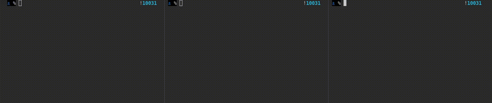

# SocketServer

A library for create network applications with PHP.

>If you like this project gift us a ⭐.

## Installation.

    $ composer require thenlabs/socket-server

## Usage.

The below code show a bare network application that accept multiple connections and forward each incoming message to the rest of the connections.

>That application can be found in the `tests/Functional/hub.php` file. For test it you can run `php tests/Functional/hub.php`.

Can be seen that the `SocketServer` class offers the necessary events for react at the differents connection status.

>Check the `SocketServer` API for knows all his possibilities.

```php
<?php
/**
 * What this program does is accept multiple connections and forward
 * each incoming message to the rest of the connections.
 */

require_once __DIR__.'/../../bootstrap.php';

use ThenLabs\SocketServer\Event\ConnectionEvent;
use ThenLabs\SocketServer\Event\DataEvent;
use ThenLabs\SocketServer\Event\DisconnectionEvent;
use ThenLabs\SocketServer\SocketServer;

class HubServer extends SocketServer
{
    protected $connections = [];

    public function onConnection(ConnectionEvent $event): void
    {
        foreach ($this->connections as $connection) {
            $connection->writeLine("New connection.");
        }

        $this->connections[] = $event->getConnection();
    }

    public function onData(DataEvent $event): void
    {
        $data = $event->getData();

        switch ($data) {
            case 'exit':
                $event->getConnection()->close();
                break;

            case 'stop':
                $event->getServer()->stop();
                break;

            default:
                foreach ($this->connections as $connection) {
                    if ($connection != $event->getConnection()) {
                        $connection->writeLine($data);
                    }
                }
                break;
        }
    }

    public function onDisconnection(DisconnectionEvent $event): void
    {
        foreach ($this->connections as $id => $connection) {
            if ($connection == $event->getConnection()) {
                unset($this->connections[$id]);
                break;
            }
        }
    }
}

$server = new HubServer(['socket' => $argv[1] ?? 'tcp://127.0.0.1:9000']);
$server->start();
```

The above example works as follows:



## Development.

### Running the tests.

For run the tests, runs the next command:

    $ ./vendor/bin/pyramidal